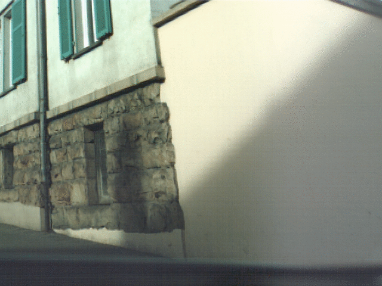
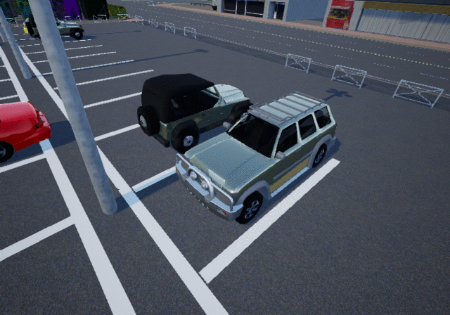

# Deep Shutter Unrolling Network

This repository contains the code and datasets to reproduce the results from the
paper [Deep Shutter Unrolling Network](https://drive.google.com/open?id=14NYguVp129ydRtRzhhU8H8QIiE0coK6x) by [Peidong Liu](http://people.inf.ethz.ch/liup/), 
[Zhaopeng Cui](https://zhpcui.github.io), [Viktor Larsson](http://people.inf.ethz.ch/vlarsson/) and [Marc Pollefeys](https://inf.ethz.ch/personal/marc.pollefeys/). Additional supplementary materials can be found from [supp](https://drive.google.com/open?id=1ox9X-pYMgnSPP_hkeso21bUL_QoKJcrp). More details can also be found from our [slides](https://drive.google.com/open?id=1V2mUqaUeBEBJkS6-WQaXVyu_Pw_S5MLV) and [video](https://drive.google.com/open?id=1GDngV57vxhd4xqYpvAY5r9H832OL5fm_).

We present a novel network architecture for rolling shutter effect rectification. We also contribute two large datasets for deep network training and evaluation. Our network takes two consecutive rolling shutter images and predicts the corresponding global shutter image of the latest frame. Our network only requires ground truth global shutter image for supervision. Following examples demonstrate that our network is able to correct the rolling shutter distortions.

 

You can find detailed usage instructions for training your own models
and using pretrained models below.

If you find our code, datatsets or paper useful, please consider citing:
```
@InProceedings{Liu2020CVPR,
  author = {Peidong Liu and Zhaopeng Cui and Viktor Larsson and Marc Pollefeys},
  title = {Deep Shutter Unrolling Network},
  booktitle = {Proc. IEEE Conf. on Computer Vision and Pattern	Recognition (CVPR)},
  year = {2020}
}
```

## Dependencies installation
To train or test the model, you need to install the dependent packages via
```
pip install -r requirements.txt
```
The code is tested with PyTorch 1.1.0 with CUDA 9.0.

#### Install correlation package
```
cd ./package_correlation
python setup.py install
```

#### Install differentiable forward warping package
```
cd ./package_forward_warp
python setup.py install
```

#### Install core package
```
cd ./package_core
python setup.py install
```

## Demo with our pretrained model
You can now test our code with the provided images in the `demo` folder.
To do this, simply run
```
sh download_pretrained_models.sh
sh demo.sh
```

## Datasets
If you want to evaluate your/our network with our datasets, you
can download them as follows.

* [Fastec training data](https://drive.google.com/open?id=1gJoI7PSv7KEm2qb9-bt6hiyZ3PPlwEpd):
  the training data (~2G) from the Fastec rolling shutter dataset.

* [Fastec test data](https://drive.google.com/open?id=1Yfu6sOgIa6vJ6VwAedycjLu-_7rx7vZ2):
  the test data (~930 MB) from the Fastec rolling shutter dataset.

* [Carla training data](https://drive.google.com/open?id=15vXSX3g_STd6RPDWLg2sIn11mKH0sXxg):
  the training data (~10G) from the Carla rolling shutter dataset.

* [Carla test data](https://drive.google.com/open?id=1rvN0q5KF9BTxBOx4oOyxJKzX8XkUB-zM):
  the test data (~2G) from the Carla rolling shutter dataset.

## Code used to synthesize the Carla rolling shutter dataset
We also release the source code, which is used to synthesize the Carla rolling shutter dataset by using an Unreal game engine. 
For more information, please visit our project website on [Github](https://github.com/ethliup/UnrealCV).

## Evaluation with our pretrained model
If you want to re-produce the same experimental results as what our paper demonstrates,
please download the Fastect test data and the Carla test data to your local computer.

Then you can run following commands to get the results.
```
bash download_pretrained_models.sh
# !! Please update the path to test data in 'inference.sh'
# !! with your own local path, before run following command!!
sh inference.sh
```

## Training with our datasets
If you want to re-train the network with our datasets, please download
the Fastec training data and the Carla training data to your local computer.

Then you can run following commands to re-train the networks.
```
# !! Please update the corresponding paths in 'train.sh' with  #
# !! your own local paths, before run following command!!      #

sh train.sh
```

